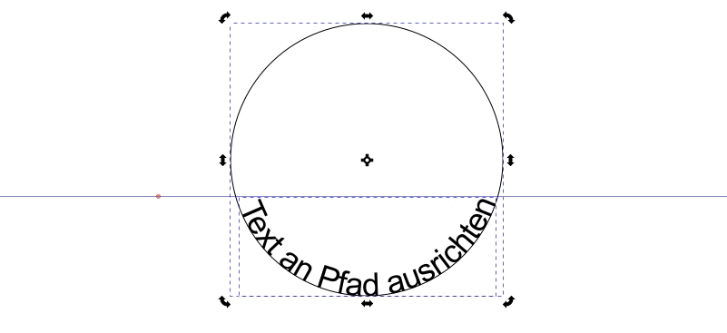
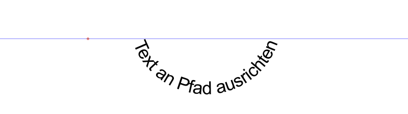

<a name="oben"></a>

<div align="center">

|[:skull:ISSUE](https://github.com/frankyhub/Inkscape-Tutorial/issues?q=is%3Aissue)|[:speech_balloon: Forum /Discussion](https://github.com/frankyhub/Inkscape-Tutorial/discussions)|[:grey_question:WiKi](https://github.com/frankyhub/Inkscape-Tutorial/wiki)||
|--|--|--|--|
| | | | |
||<a href="https://github.com/frankyhub/Inkscape-Tutorial/issues">|<a href="https://github.com/frankyhub/Inkscape-Tutorial/discussions">|<a href="https://github.com/frankyhub/Inkscape-Tutorial/releases">|
|| <a href="https://github.com/frankyhub/Inkscape-Tutorial/pulse" alt="Activity">| <a href="https://github.com/frankyhub/Inkscape-Tutorial/graphs/traffic">  |<a href="https://github.com/frankyhub?tab=stars"> |
</div>


## Inkscape Tutorial


### Einleitung
Inkscape ist ein professionelles Programm zur Bearbeitung von Vektorgrafiken für Windows, Mac OS X und GNU/Linux. Es wird dazu verwendet, Bilder, wie Illustrationen, Icons, Logos, Diagramme, 
Karten oder auch Webgrafiken, zu gestalten. Inkscape nutzt den freien Standard SVG (Scalable Vector Graphics) und ist eine freie, quelloffene Software. Inkscape hat leistungsstarke Zeichenwerkzeuge, 
es kann unter anderem die Dareiformate SVG, AI, EPS, PDF, PS und PNG im- und exportieren. Es enthält umfangreiche Funktionen, eine einfache Oberfläche und es kann erweitert werden: Benutzer können Funktionen 
mithilfe von Add-Ons anpassen. So können die Inkscape-Dateien z.B. für Lasercutter, Foliencutter oder für den 3D-Druck weiterverarbetet werden.
Dieses Tutorial beschreibt die Grundlagen für die Verwendung von Inkscape. Das Grundlagentutorial behandelt die Themen Seitennavigation, Dokumentenerstellung, Grundlagen der Formwerkzeuge, Techniken der Objektauswahl, 
Objektmanipulation mit dem Auswahlwerkzeug, Gruppierung, Ändern von Füllfarbe und Kontur, Texte hinzufügen, Text an Pfad ausrichten, eine Stempel-Vorlage erstellen, Vektorisieren von Rastergrafiken und KiCAD-Vorlage 
mit Inkscape erstellen.

Inkscape Programm Download und Erweiterungen: https://inkscape.org/de/

### Die Arbeitsfläche verschieben
Es gibt mehrere Möglichkeiten die Arbeitsfläche zu verschieben, sehr einfach kann das Arbeitsblatt mit dem   Mausrad   nach oben und nach unten bewegt werden. Betätigt man zusätzlich die   Umschalt   - Taste wird die 
Arbeitsfläche nach links und rechts bewegt. Mit dem gedrückten   Mausrad   kann das Arbeitsblatt in alle Richtungen veschoben werden.

### Herein- und Herauszoomen
Die einfachste Möglichkeit zu zoomen bieten die Tasten    -    und    +  . Alternativ kann man per   Steuerung  +  Mausrad   hereinzoomen. Außerdem lässt sich der Zoomwert in Prozent direkt in das 
Zoomeingabefeld im rechten unteren Bereichs des Dokumentenfensters, beschriftet mit "Z" eingeben und mit  Return   bestätigen. Es gibt noch das Zoom-Werkzeug "Lupe" links in der Werkzeugleiste, mit 
dem du in ein Gebiet hereinzoomen können, indem du ein Rechteck darum ziehst.

### Inkscape-Werkzeuge
In der oberen, waagrechten Werkzeugleiste befinden sich Werkzeuge wie "neues Dokument", "Dokument öffnen" oder "Drucken". Je nach der EInstellung im Menü Ansicht, können die Werkzeugleisten ein/ausgeblendet 
oder in ihrer Position verändert werden. Die senkrechte Werkzeugleiste auf der linken Seite zeigt Inkscapes Zeichen- und Bearbeitungswerkzeuge. Mit diesen Werkzeugen können wir die verschiedesten Formen zeichnen.
Die senkrechte Werkzeugleiste auf der rechten Seite zeigt Werkzeuge zum positionieren der Objekte wie Einrasten.

### Formen erstellen
Nun ist es Zeit, ein paar Formen zu erstellen! Klicke auf das Rechteckwerkzeug in der Werkzeugleiste auf der linken Seite oder die  R  -Taste und zeichne Rechtecke. Mit  Steuerung  +  Z   können Aktionen rückgängig gemacht werden.
Mit dem Auswahl Werkzeug (Pfeiltaste links oben) oder der  S  -Taste kann man mit gedrückter linker Maustaste einen Rahmen um seine Objekte ziehen und mit der  Entf  -Taste wieder löschen.


### Mit anderen Werkzeugen lassen sich auch Ellipsen, Sterne und Spiralen erstellen:


### Bewegen, Größe ändern, Drehen
Das am häufigsten verwendete Werkzeug in Inkscape ist das Auswahlwerkzeug. Klicke den obersten Knopf (mit dem Pfeil) in der Werkzeugleiste, oder das S. Nun kannst du jedes Objekt auf der Seite auswählen.


Du siehst jetzt acht pfeilförmige Anfasser um das markierte Objekt. Jetzt hast du mehrere Möglichkeiten:
- Verschieben des Objekts durch Ziehen mit gedrückter  linker Maus  -Taste. Drücke gleichzeitig  Strg  -Taste, um die Bewegung auf horizontale oder vertikale Richtung zu beschränken.
- Ändere die Größe des Objektes durch Klicken und Ziehen an einem Anfasser. Drücke gleichzeitig die  Strg  -Taste zum Beibehalten des Seitenverhältnisses.

Nun klicke noch einmal auf das Rechteck. Die Anfasser sehen jetzt anders aus. Jetzt gibt es folgende Möglichkeiten:
- Drehen des Objektes durch Klicken und Ziehen an den Eck-Anfassern. Zum stufenweisen Drehen in Schritten von 15° halte  Strg   gedrückt. Verschiebe das Kreuz in der Mitte, um den Drehmittelpunkt festzulegen.
Verändere die Form des Objekts durch Klicken und Ziehen an den Anfassern an den Längsseiten. Der aktuelle Scher-Winkel wird unten in der Taskleiste angezeigt.


Wenn das Auswahlwerkzeug aktiv ist und ein oder mehrere Objekte ausgewählt sind, kann man auch die Eingabefelder in der Werkzeugeinstellungsleiste über der Arbeitsfläche benutzen, um genaue Werte für die Koordinaten (X und Y) und die Größe (B und H) einzugeben.


### Mehrfachauswahl
Man kann mehrere Objekte gleichzeitig durch  Umschalt  +  linke Maus  -Taste, oder durch Ziehen um die Objekte herum auswählen. Letzteres wird Gummibandauswahl genannt. Das Auswahlwerkzeug erzeugt das 
Gummiband durch Ziehen über einem leeren Teil der Seite, aber immer auch, wenn vor dem Ziehen die  Umschalt  -Taste gedrückt wird. Übe das, indem du drei Formen markierst:


Jedes einzelne Objekt einer Auswahl zeigt einen Objektrahmen - normalerweise einen gestrichelten, rechteckigen Rahmen. So kann man ganz einfach sehen, was ausgewählt ist und was nicht.

-  Umschalt  +  linke Maus  -Taste auf ein markiertes Objekt entfernt es aus der Auswahl. Wähle alle drei Objekte aus und benutze dann  Umschalt  +  linke Maus  -Taste, um die Auswahl herauszunehmen oder wieder zu akivieren.

Nach einem Druck auf Esc sind keine Objekte mehr ausgewählt.  Strg  +  A  -Taste wählt dagegen alle Objekte der momentan aktivierten Ebene aus.

### Gruppieren
Mehrere Objekte können zu einer Gruppe zusammengefasst werden. Eine Gruppe verhält sich wie ein einzelnes Objekt, wenn man sie verschiebt oder mit den Anfassern verformt.
Um eine Gruppe zu erzeugen, wählt man ein oder mehrere Objekte aus und drückt die  Strg  +  G  -Taste. Um die Gruppierung bei einer oder mehreren Gruppen aufzuheben, markiert man diese und drückt die  Umschalt  +  Strg  +  G  -Taste.
Diese Funktionen finden sich auch im Kontextmenü, öffne es mit einem  Maus Rechtsklick  , dem Menü Objekt und der Befehlsleiste. Gruppierungen können selbst auch gruppiert werden, wie jedes andere Objekt auch.
Solche verschachtelten Gruppierungen können beliebig tief weitergeführt werden. Einmaliges drücken der  Strg  +  linke Maus  -Taste hebt nur die letzte Gruppierung einer ausgewählten Gruppe auf.


### Füllung und Kontur
Die wohl einfachste Möglichkeit, wie man ein Objekt einfärben kann, ist, es auszuwählen und dann auf eines der Farbmuster, also eines der farbigen Kästchen unterhalb der Arbeitsfläche, zu klicken. Dies ändert die Füllfarbe.


Alternativ kann der "Füllung und Kontur" vom Ansicht-Menü aus geöffnet werden oder mittels  Umschalt  +  Strg  +  F  -Taste.
Du wirst sehen, dass der Dialog drei Reiter hat: Füllung, Farbe der Kontur, und Muster der Kontur. Im Reiter "Füllung" ändert man die Füllfarbe (Innenfarbe) des markierten Objekts.
Mit den Knöpfen direkt unter dem Reiter kann man die Füllungsart verändern: die Füllung ganz ausschalten (mit dem Knopf mit dem X), einfach einfarbig füllen, oder einen Linear- und Radialverlauf auswählen. Bei dem Objekt oben ist der Knopf "Einfache Farbe" aktiviert.

Weiter unten sieht man verschiedene Farbwahlmöglichkeiten. Jede hat einen eigenen Reiter: RGB, HSL, CMYK und Farbrad. Wahrscheinlich am praktischsten ist das Farbrad, bei dem man das Dreieck verdrehen kann, um den Farbton zu wählen und dann die gewünschte Helligkeit im Dreieck auswählt. Alle Farbwähler besitzen einen Schieberegler beschriftet mit "A", um den Alpha-Kanal (die Deckkraft) der ausgewählten Farbe einzustellen.


Immer, wenn du ein Objekt auswählst, zeigt der Farbwähler dessen aktuelle Farbe und Kontur. Bei mehr als einem markierten Objekt wird die Durchschnittsfarbe angezeigt.

Mit dem Reiter "Farbe der Kontur" kann man die Kontur (Außenlinie) des Objektes entfernen, oder ihr eine beliebige Farbe und Deckkraft zuordnen.

Der letzte Reiter "Muster der Kontur" dient zum Einstellen der Breite und anderer Eigenschaften der Kontur.

Statt einer einfachen Farbe kann man auch Farbverläufe für Füllung und/oder Kontur benutzen.

### Texte hinzufügen
Wähle das Textwerkzeug in der Symbolleiste aus oder drücke die  Umschalt  -Taste  +   Steuerung   +   T  . Das Fenster [Text und Schriftart] wird angezeigt. Betätige den Kartenreiter [Text]. 
Es öffnet sich der Texteditor für die Eingabe des Textes. Mit betätigen des Kartenreiters [Schrift] ist die Schriftart und Schriftgröße einzustellen. Stelle eine passende Schriftart für dein 
Projekt ein und klicke dann auf [Anwenden]. Mit einem Klick auf [Als Standard festlegen] werden alle ab jetzt angelegten Textobjete diese Einstellung übernehmen.


Alternativ kann man in der linken Werkzeugleiste das Textwerkzeug auswählen und an die Stelle des Arbeitsbereichs klicken, wo man den Text hinzufügen möchte.


Textobjekte können wie jedes andere Objekt auch mit Farben versehen und beliebig skaliert werden. Für weitere Textobjekte wähle wieder das Textwerkzeug in der Werkzeugleiste aus und klicke danach an die jeweils gewünschte Position für den Text im Arbeitsbereich. Durch einen Doppelklick auf ein Textobjekt kannst du den enthaltenen Text bearbeiten. Um Textobjekte mit anderen Objekten zusammenzuführen, musst du diese in Pfade konvertieren. Markiere hierzu den Text und klicke auf [Pfad] [Objekt in Pfad umwandeln]. Danach kann der Text nicht mehr bearbeitet werden.

### Text an Pfad ausrichten
Inkscape bietet die Möglichkeit, Textzeilen in eine gewüschte Form zu bringen, z. B. in Kreisform oder in ein Oval. Die nachfolgenden Schritte berscheiben die Funktion.

+ Text schreiben.
+ Schriftart und Größe festlegen.
+ Evtl. keine Kontur aber Füllung auswählen (Text wird schlanker).
+ Kreis mit gedrückter Strg-Taste ziehen, Füllung ausschalten.
+ Text und Kreis mit Shift-Taste auswählen.
+ Menü: Text, Text an Pfad ausrichten.
+ Kreis markieren und Text in die gewünschte Lage drehen.



+ Ggf. den Kreis markieren und mit der unteren Markierung in ein Oval biegen.
+ Einen Buchstaben markieren.
+ Es erscheint automatisch die Symbolleiste zum Formatieren von Texten.
+ Jetzt den Text markieren und Zeichenabstand, Wortabstand und Unterschneidungen einstellen.


+ Wenn der Text ok ist, Text in Pfade umwandeln und den Kreis oder das Oval löschen.




### Eine Stempelvorlage erstellen
Inkscape bietet die Möglichkeit, eine Stempelvorlage zu erstellen, die z. B. auf Stempelgummi gelasert werden kann. Die nachfolgenden Schritte berscheiben die Funktion.

+ Text schreiben.
+ Schriftart und Größe festlegen.
+ Text spiegeln.
+ Evtl. keine Kontur aber Füllung auswählen (Text wird schlanker).
+ der Größe des gewünschten Stempels einen Rahmen um den Text ziehen.
+ Text in den Rahmen horizontal und vertikal zentrieren.
+ Text und Rahmen mit Shift-Taste auswählen und in Pfade umwandeln.
+ Die Datei in LightBurn importieren.
+ Mit "G=100, L=45 und Modus Füllen" lasern.
+ Stempel-Vorschau in LightBurn:


### Vektorisieren von Rastergrafiken
Inkscape beinhaltet ein Werkzeug, mit dem sich ein Bitmap-Bild in ein Pfad-Element umwandeln lässt. Generell kann man sagen, je höher der Anteil dunkler Pixel im Bitmap ist, desto höher ist die Vektorisierungsleistung.

Lade oder importiere das Bild, das du vektorisieren willst mit "Datei + Impotieren" und betästige mit "Öffnen".
Die Grundeinstellungen können mit OK übernommen werdenn.


Das Bitmap wird geladen:


Das Bitmap markieren und mit "Pfad Bitmap nachzeichnen" oder mit  Umschalt  +  Alt  +  B  -Taste das Fenster Bitmap nachzeichnen öffnen.


Wenn wir den "Aktualisieren-Button" betätigen wird die Vorschau geladen.


Wir können jetzt den Helligkeitsschwellwert optimieren und ggf. das Bitmap invertieren. Nach betätigen des "Anwenden" Buttons wird die Ansicht aktualisiert.


Wenn wir jetzt in das Zeichnen-Fenster wechseln, sehen wir das Bitmap und die vektorisierte Grafik.


Wählen wir jetzt das "Bearbeiten der Knoten" Werkzeug aus oder betätigen die  N  -Taste, können wir die Pfade bearbeiten oder die Vektor-Grafik speichen und in andere Programme (Lightburn, Easy Cut Studio...) importieren.


Wenn die Füllung entfernt wird, sieht man den Umriss der Zeichnung.


### KiCAD-Vorlage mit Inkscape erstellen

KiCAD ist ein Open Source CAD-Programm zur Entwicklung von Leiterplatten (PCBs). Es besteht aus mehreren Programmen u.a. einen Schaltplaneditor (Eeschema), einen Editor zur PCB-Erstellung (PCBnew) und ein Tool zum Austausch von Daten im Gerber-Format.
Mit Inkscape ist man in der Lage 2D Vektorgrafiken zu erstellen. Wir arbeiten mit der Version Inkscape 1.1. Mit der Erweiterung "Svg2Shenzhen" können mit Inkscape PCB-Formen und Designs u.a. für die Layer Edge.Cuts sowie F.SilkS erstellt werden. Hier sind die einzelnen Arbeitsschritte zur Erstellung einer PCB-Form und einem PCB-Design aufgelistet:

Die Inkscape Erweiterung Svg2Shenzhen von github oder der Inkscape.org Seite laden und in das Verzeichnis "C:\Users\User\AppData\Roaming\inkscape\extensions" kopieren.

Der Ordner für Erweiterungen kann über das Menü "Bearbeiten" -> "Einstellungen" abgefragt werden.


Inkscape neu starten.

Nach der Installation von "Svg2Shenzhen" ist unter "Erweiterungen" der Menüpunkt "Svg2Shenzhen" zu sehen.


Jetzt kann in Inkscape mit dem Erstellen der KiCAD-Vorlage begonnen werden.

Das gewünschte Bild in Inkscape importieren. In diesem Beispiel wird ein Geist verwendet.


Das importierte Bild markieren und im Menü "Pfad" -> "Bitmap nachzeichnen..." wählen.

Den Helligkeitsschwellwert entsprechend den untensthenden Bild einstellen und aktualisieren. Den Haken bei "Bild invertieren" setzen.

Mit OK bestätigen und das Fenster schließen.


Das erstellte Bitmap wird die Front-Ansicht der Platine.

Jetzt wird der Platinen-Umriss erzeugt und der Schritt "Pfad" -> "Bitmap nachzeichnen..." wiederholt.

Dabei verändern wir die Einstellung "Helligkeitsschwellwert" so, dass der gesamte Umriss zu sehen ist.


Beim Umriss mit "Füllung und Kontur" die Füllung deaktivieren.


Mit dem Pfadwerkzeug das Gesicht im zweiten Bitmap löschen, es bleibt nur der Umriss übrig.

Wir haben jetzt den Geist als Kontur (Umriss) und als Bitmap (Frontansicht der Platine).


Die Datei wird jetzt gespeichert.

Im Menü "Erweiterungen" -> "Svg2Shenzhen" "1. Prepare Document..." auswählen und die "Document-Maße" großzügig einstellen.

Die Haken bei den Layer "F.SilkS" und "Edge.Cuts" auswählen und mit "Anwenden" bestätigen.


Das Fenster schließen. Es wurden die beiden gewählten Ebenen "F.SilkS" und "Edge.Cuts" erzeugt.

Den Umriss markieren und mit einem Rechtsklick der Maus den Umriss in die Ebene "Edge.Cuts" verschieben.

Die Frontansicht der Platine markieren und mit einem Rechtsklick der Maus in die Ebene "F.SilkS" verschieben.

Die Frontansicht und den Umriss übereinander legen und in den mit Svg2Shenzhen erzeugten Rahmen verschieben.


Zur Kontrolle können die Ebenen ein- und ausgeblendet werden.

Im Menü "Erweiterungen" -> "Svg2Shenzhen" "2. Export to KiCAD..." auswählen und den gewünschten Export-Pfad angeben.

Mit "Anwenden" bestätigen.


Im Export-Pfad die PCB-Layout-Datei öffnen.


Mit "Alt+3" kann das Layout kontrolliert werden.


### OpenScad-Vorlage mit Inkscape erstellen

Eine Inkscape-Zeichnung kann in OpenScad importiert und extrudiert werden. 

Die Inkscape Zeichnung:


In OpenScad wird die Zeichnung importiert und extrudiert:

```
//Weihnachtsdeko

fn=$60;
linear_extrude(height = 5, center = true, convexity = 10)
import("Sesamkugel8.svg");

```


Schlusswort
Dies ist das Ende des Grundlagen-Tutorials. Das waren längst noch nicht alle Funktionen in Inkscape, aber mit den hier vermittelten Techniken kannst du schon einfache, aber nützliche Grafiken erstellen. Um kompliziertere Techniken zu erlernen, schaust du dir die Tutorials auf der Inkscape Internet-Seite an.

Viel Spass mit Inkscape!

---

<div style="position:absolute; left:2cm; ">   
<ol class="breadcrumb" style="border-top: 2px solid black;border-bottom:2px solid black; height: 45px; width: 900px;"> <p align="center"><a href="#oben">nach oben</a></p></ol>
</div>  

---
